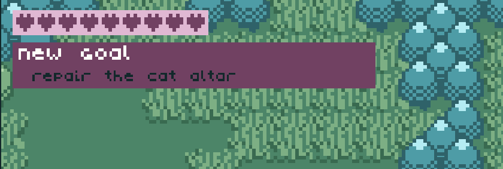
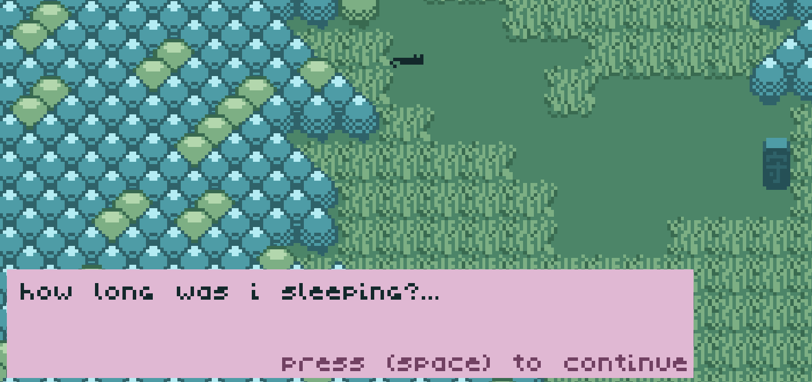
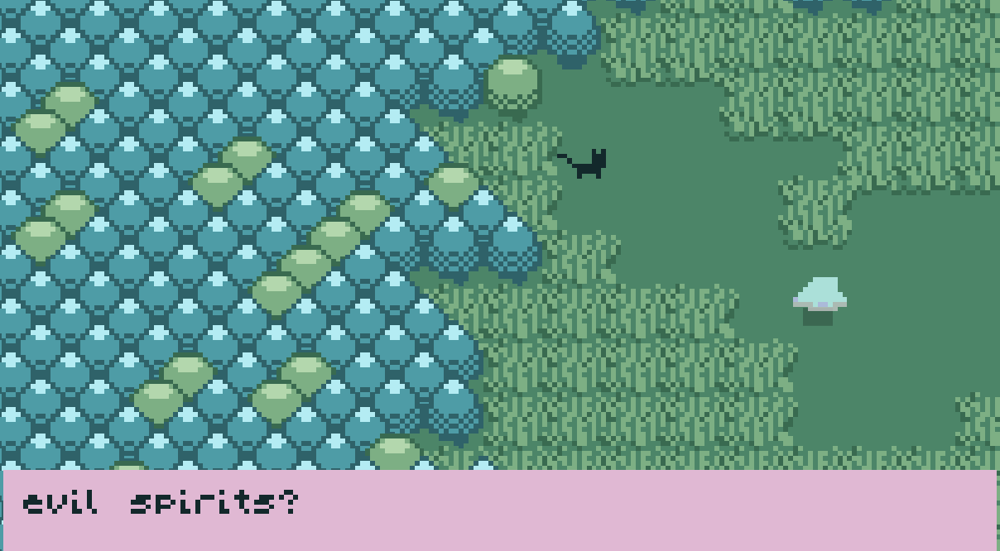
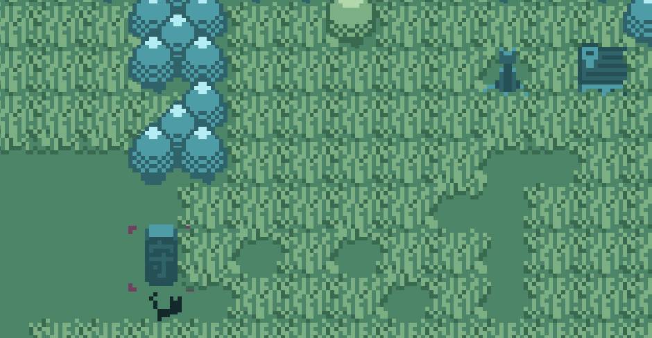
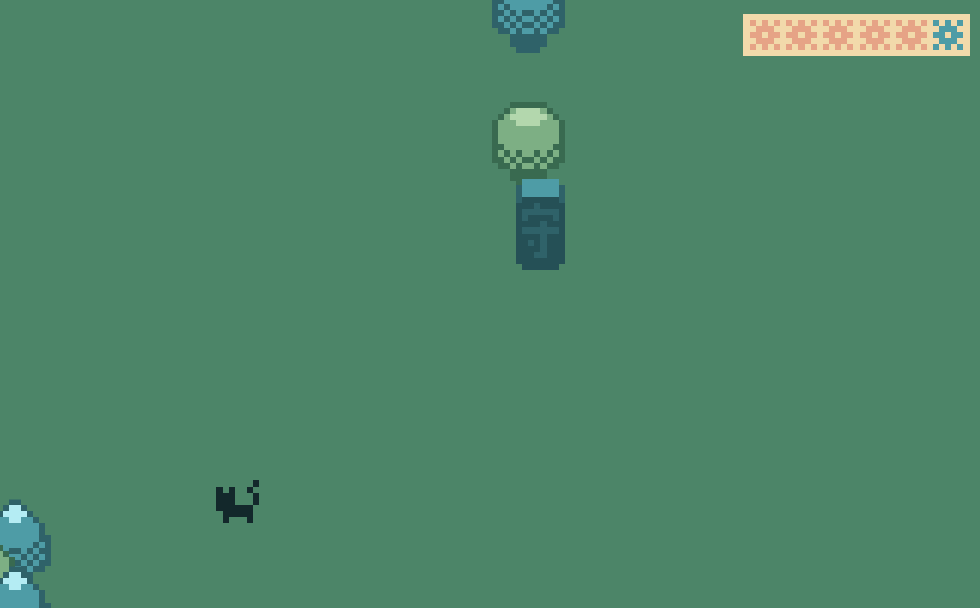
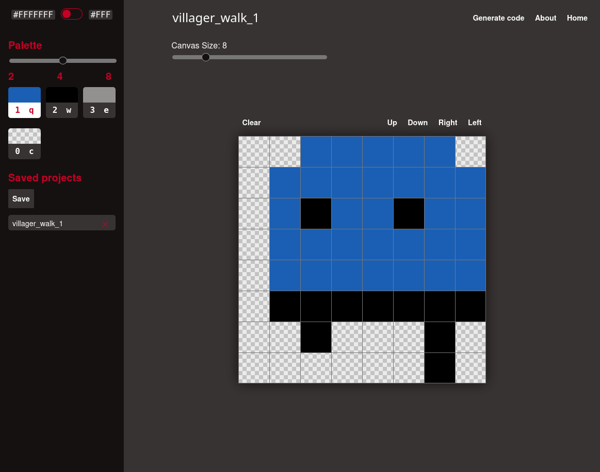
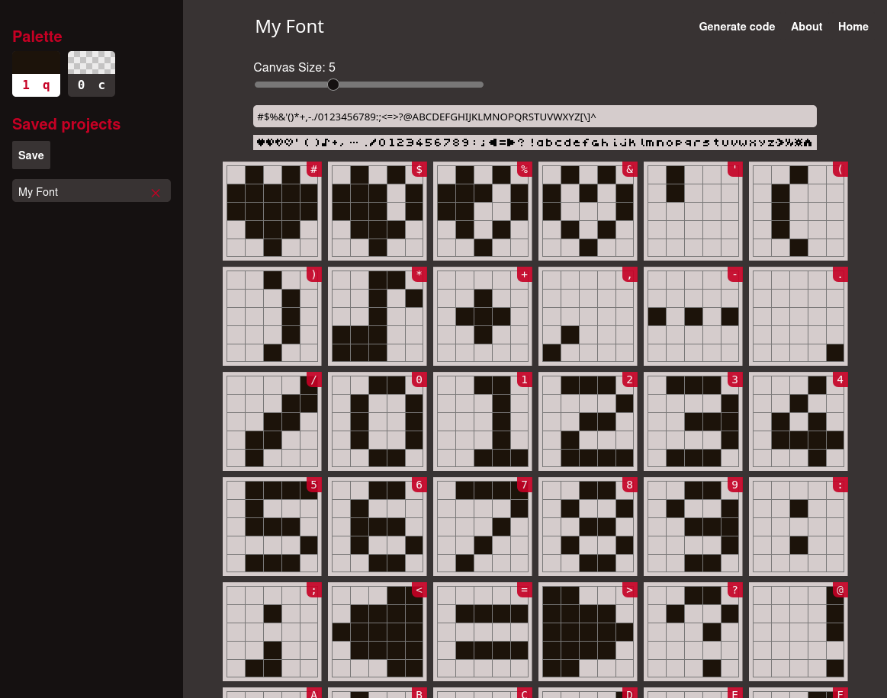
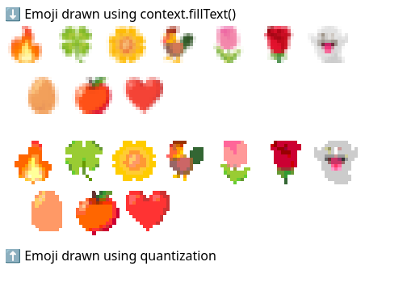
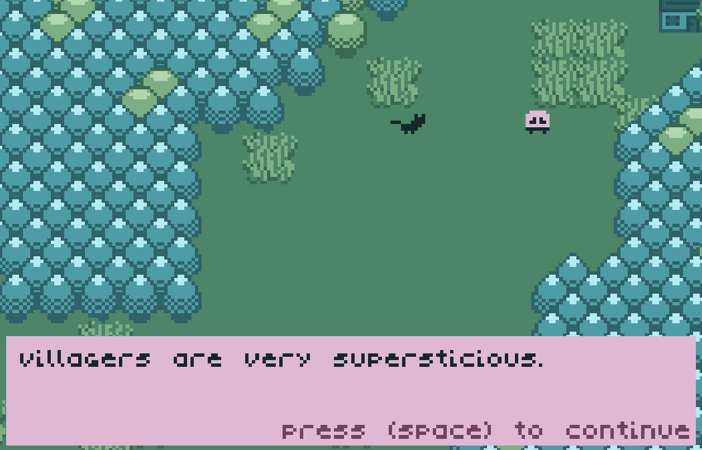
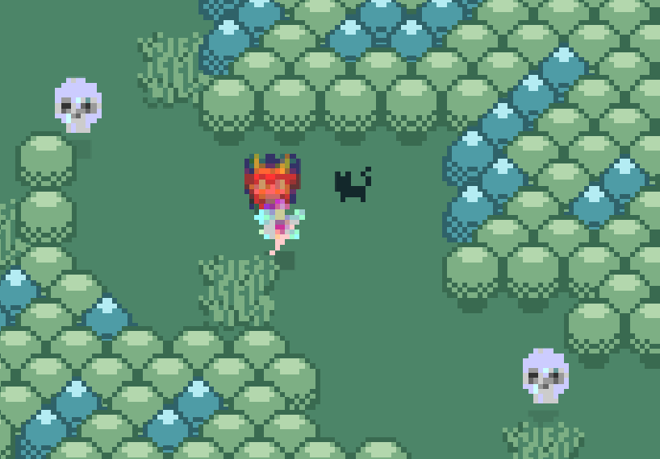

# Meow Mountain - Postmortem of a 13KB Game

Another [JS13k Games](https://www.js13kgames.com) just ended and I was able to preserve my 8-year streak of participating in this game jam. In this essay, I'd like to share some of the "low-tech tech" I've used—many of these are low-level development techniques that help me create tiny games.

## Contents

- [About the game](#about-the-game)
- [Game concepts](#game-concepts)
  - [Ideas that didn't make it](#ideas-that-didnt-make-it)
  - [Main concept](#main-concept)
    - [Story Engine](#story-engine)
  - [Reusable components](#reusable-components)
    - [Sprites](#sprites)
    - [Font](#font)
    - [Emoji icons](#emoji-icons)
    - [Sound effects](#sound-effects)
    - [Music](#music)
  - [Other game features](#other-game-features)
    - ["AI"](#ai)
      - [The villager](#the-villager)
      - [The spirit](#the-spirit)
    - [Map generation](#map-generation)
- [Final notes](#final-notes)

## About the game

This year's "black cat" theme inspired me to create a grid-based adventure game. Over the years, I've explored different genres, learning new game development concepts in the process.

"Meow Mountain" tells the story of a magical cat who is the protector of a mountain. After taking too long of a nap, the cat accidentally let the magic barrier protecting the mountain from evil spirits collapse. As a result, the villagers inhabiting the mountain stopped tending to the cat altars scattered around the mountain. These altars are essential to the cat's magical abilities, so our protagonist must repair all altars, restore the barrier, and bring peace back to the mountain.

## Game concepts

### Ideas that didn't make it

This was my first time developing a grid-based game, as well as my first adventure game. The time and size restrictions meant many ideas I had for lore and game mechanics were left on the cutting room floor.

Initially, the cat was going to be a witch who could transform into a cat to discreetly sneak around the mountain without being seen by villagers. The witch would use her magic powers to help the villagers by improving their harvests, clearing trails they needed to travel between villages, or ensuring they had access to food and water. These side-quests would then motivate the villagers to make offerings at the cat altars, which would provide magic power to the witch. In retrospective, this game mechanic was obviously far too complex to implement alongside everything else.

Another idea I initially wanted to explore was creating an AI for the villagers. The villagers in the game just wander aimlessly around their village (more on this below). My initial goal was for them to live in houses and having daily routines and jobs. They would leave home each day to go to their workplace, and some could travel between villages. Sadly, none of this made it into the game, so their movements are mostly random.

I also envisioned a more detailed goals & achievements system that players could consult to know what they needed to do next. Because the quest system ended up much simpler (repair the obelisk and the statues) this was no longer a priority. I still show a "new goal" pop-up, which has been well received, but there's no way to review current objectives.



Finally, I planned for the player to be able to use magic for things other than restoring the magic barrier. I had envisioned conjuring spells and special attacks that would aid in side-quests and fighting spirits. Conversely, I wanted the different spirits to also have different powers and attack patterns.

I do wish to find the motivation and time to continue improving my game, and possibly revisit these ideas.

### Main concept

I've been wanting to make a Zelda-style RPG game for a while. This year I finally felt confident I could pull it off. The game has a simple story: the protagonist fell into a long nap and the world fell into chaos. The main quest is to repair the barrier by finding the magic obelisk. When the player attempts to restore the barrier, they learn they've run out of magic, so something must be wrong with the cat altar. After repairing the cat altar, the player discovers this isn't enough to restore all their magic, and they must find all altars.

#### Story Engine

I've used dialogs to guide the player step by step.



I created a simple reusable "story engine" that consumes a storyline data structure and keeps track of dialogs and game events. It's quite rudimentary, as this was my first time implementing something like this. I made creating a clear storyline and onboarding a priority this year because one recurring issue in JS13k is that games confuse players without lengthy manuals. But as they say:

> Ain't nobody got time for that.
> -- Plato or Einstein or something.

History shows that people don't like reading instructions. So the game starts with soft exposition. The player learns about the existence of spirits, and that this means that the magic barrier has disappeared.



This also introduces the player to the protagonist's combat abilities. Technically, the first spirit (and in fact, all others) doesn't need to be killed. Running away is a viable strategy in this game.



Whenever possible, I tried showing instead of telling. The protagonist finds themselves surrounded by thick bushes. Technically, players are free to cut through the grass and leave the home meadow, but a subtle path tries to guide them toward the cat statue. Once the first statue is cleared, the main actions should be obvious: scratch, repair the obelisk, and repair the statues. I left two other mechanics unexplained for players to discover: teleporting from other statues to the home statue, and "sleeping" at home to restore health.



The game occasionally shows a few more dialogs to guide the player, but game progress is primarily tracked by the magic gauge. Once that gauge is full, it means the player has restored their magic power and can restore the barrier once again.

### Reusable components

Over the years, I've learned how to implement various game features. While modern game engines handle most things related to sounds, images, physics, etc., in JS13k you can't afford to use a large, general-purpose game engine. This means much of the core engine functionality has to be carefully optimized.

Following are some reusable blocks I've developed and improved over the years.

#### Sprites

I've written before about how I've made games without any image files ([read more here](https://dev.to/lopis/a-tiny-pixel-art-game-using-no-images-49df)). There are different ways to achieve this. Images can be procedurally generated (e.g., the minimap in Meow Mountain), drawn using canvas primitives (e.g., all the background images in [Market Stree Tycoon](https://jlopes.dev/games/market/), as well as the UI elements in Meow Mountain), or encoded as part of the source code.

I was inspired by [xem](https://xem.github.io/) some years ago to streamline icon creation. When I made Market Street Tycoon, I created my [Mini Pixelart Editor](https://lopis.github.io/mini-pixelart-editor/image-editor.html), an online pixelart editor focused on creating pixelart with a limited palette, and then generating a string-encoded version of the sprite along with the necessary JavaScript to decode it.



This served me well in recent years since my games were never very image-heavy. However, Meow Mountain has dozens of sprites, including several animations. My sprite editor became too cumbersome to use, so I reverted to plain old PNGs. PNGs compress well when using a limited palette, so this worked for a while. However, I soon felt the need to free up precious bytes from my game.

I wrote scripts to help encode my PNGs into simpler strings, similarly to what the Mini Image Editor did. In general terms, this is how it works:

- The first script reads a spritesheet and chops it into individual images
- The second script converts an image into an array of values and a list of colors:
  - The list of colors contains all colors present in the image
  - The array of values contains the index of each color in the palette
  - `[[1,0,0,0,0,0,0,0],['#000000']]` represents a 3x3 transparent image with a black pixel in the corner
- The third script encodes this information into a string:
  - Since the image has only 2 colors (black and transparent), we only need 1 bit per pixel
  - Our array becomes the number `10000000` in binary, which in base 32 is `40`

One advantage of this method is that color information is now detached from pixel information, so I can reuse the same game palette throughout. Reusing the same sprite in different colors also becomes trivial. For my 16x16 icons, I achieved around 40% reduction in sprite size, even accounting for the extra decoding code.

I'm hoping to further streamline sprite management into a reusable npm package.

#### Font

Similar to sprite rendering, I've been using a pixel font where each character is a string-encoded sprite. Since text is just a single color, each letter can be thought of as a 1-bit sprite. For this game I used a 5x5 pixel font. However, unlike last year, I improved the rendering to allow for non-square glyphs. Until now, my fonts were always monospaced.

To make font editing simpler, I use my [Mini Font Editor](https://lopis.github.io/mini-pixelart-editor/font-editor.html), which is a fork of the mini pixelart editor adapted for creating pixelart fonts.



The encoded font looks like this:

```js
export const tinyFont = '6v7ic,6trd0,6to3o,6nvic,55eyo,2np50,2jcjo,3ugt8,34ao,7k,glc,1,opzc,3xdeu,3sapz,8rhfz,8ri26,1bzky,9j1ny,3ws2u,9dv9k,3xb1i,3xbmu,2t8g,2t8s,26ndv,ajmo,fl5ug,3x7nm,n75t,54br,59u0e,53if,rlev,4jrb,1yjk4,4eav,55q95,18zsz,mi3r,574tl,1aedd,ljn9,a1bd,4f1i,a1fs,549t,53ig,5832,1dwsh,6iw6,6ix0,cbsa,6gix,6fk4,aky7,7mbws,cvtyq,deehh,2sfi3'.split(',');
```

and just like the sprites, each string like `6v7ic` is a base 32 number, which when converted to binary represents a 1-bit array of black and transparent pixels.

The rendering logic is slightly different from sprites, but I'm hoping to bring both together in the same reusable npm package.

#### Emoji icons

This year I also explored using pixel-art emoji icons as a way to save precious bytes. After all, an emoji costs 2-3 bytes, while a single multi-color icon costs tens of bytes.



The problem is that if you just try to render emoji in canvas, you get a blurry anti-aliased mess. What if we could somehow pre-process emoji to restrict the color palette and eliminate color and alpha anti-aliasing? You can find [my experiments over on code pen](https://codepen.io/lopis/pen/gbaKYVo).

The downside of this method is that devices and browsers use different emoji fonts. Unless we load an actual emoji font, we lose control of how parts of the game look. However, I believe this goes against the spirit of JS13kGames (though others might disagree). This was my first attempt at this approach, so the code might not be the most efficient or elegant.

```ts
/**
 * Quantizes rgba color values to 8bit.
 */
const quantizeToPalette = (r: number, g: number, b: number, a: number) => {
  // 1-bit transparency
  if (a < 128) {
    return [0, 0, 0, 0]; // transparent
  }
  const qr = Math.round(r / 51) * 51;
  const qg = Math.round(g / 51) * 51;
  const qb = Math.round(b / 51) * 51;

  return [qr, qg, qb, 255];
};

/**
 * Converts an emoji to a pixelated image by quantizing the colors
 * to 8 bit and the transparency to 1 bit.
 */
export const emojiToPixelArt = (
  emoji: string,
  fontSize = 10,
): HTMLImageElement => {
  // Some emoji are a bit bigger than the font
  const spriteScale = 0.25;
  const spriteSize = Math.floor(fontSize * (1 + spriteScale));
  const padding = Math.floor(fontSize * spriteScale / 2);

  // Create temporary canvas
  const [_, tmpCtx] = createCanvasWithCtx(spriteSize, spriteSize);

  // Draw emoji in chosen font size
  tmpCtx.font = `${fontSize}px sans-serif`;
  tmpCtx.textBaseline = 'top';
  tmpCtx.clearRect(0, 0, spriteSize, spriteSize);
  tmpCtx.translate(-1, 0);
  tmpCtx.fillText(emoji, padding, padding);

  // Read pixels
  const imgData = tmpCtx.getImageData(0, 0, spriteSize, spriteSize);
  const data = imgData.data;

  // Create new image data with quantized colors
  const outImg = tmpCtx.createImageData(spriteSize, spriteSize);
  const outData = outImg.data;
  for (let i = 0; i < data.length; i += 4) {
    const [r, g, b, a] = quantizeToPalette(
      data[i],      // red
      data[i + 1],  // green
      data[i + 2],  // blue
      data[i + 3],  // alpha
    );
    outData[i] = r;
    outData[i + 1] = g;
    outData[i + 2] = b;
    outData[i + 3] = a;
  }

  // Create a new canvas to draw the quantized image
  const [outCanvas, outCtx] = createCanvasWithCtx(spriteSize, spriteSize);
  outCtx.putImageData(outImg, 0, 0);

  // Create an image element from the canvas
  const img = new Image();
  img.src = outCanvas.toDataURL();
  return img;
};
```

#### Sound effects

Sound effects are small audio clips used in games. Meow Mountain has various sound effects for moving, attacking, taking damage, etc. Since sound files are typically very large, JS13K game developers usually produce sounds by rendering a sound wave and playing it with the Web Audio API. My "sound player" looks like this:

```ts
export const playSound = (f: (i: number) => number) => {
  // Create a new audio buffer.
  // This buffer has 96000 samples (audio "pixels")
  // and 48000 samples per second. More samples
  // per second allows for higher sound quality.
  const m = audioCtx.createBuffer(1,96e3,48e3);
  
  // Create an audio buffer, that will contain
  // the sound data.
  // Access a single channel data for mono sound.
  // For stereo, more channels can be used.
  const b = m.getChannelData(0);
  
  // This function expects an f() function,
  // which generates a sound wave for each sample i
  for(let i = 96e3; i--;) b[i] = f(i);
  
  // The buffer source object controls the 
  // playback.
  const s = audioCtx.createBufferSource();

  // We connect the buffer to the source
  // and connect source to the audio destination
  // which by default is your device's speakers.
  s.buffer = m;
  s.connect(audioCtx.destination);
  
  // Start the audio.
  s.start();
};
```

The f() wave function can be any function that consumes `i` and returns a number.
For example, `f(i) => Math.sin(i)` returns a pure sine wave. The function that plays a step sound in Meow Mountain looks like this:

```ts
export const step = playSound((i: number) => {
  const n = 2e3;
  return i > n ? 0 : 0.15 * (Math.random() * 2 - 1) * Math.sin((Math.PI * i) / n);
});
```

`Math.sin((Math.PI * i) / n)` provides a certain pitch to the sound, while `(Math.random() * 2 - 1)` provides random noise.
Noise helps the wave sound more "natural" and less like a pure wave.
In this example, `0.15` is used to reduce the amplitude of the wave (the sound volume) to 15%.

#### Music

To play music, I use an [audio worklet](https://developer.mozilla.org/en-US/docs/Web/API/AudioWorklet).
Worklets are small browser workers that run in the background doing work on a separate thread, preventing the main JavaScript thread from being blocked.
For example, to produce continuous music at a sample rate of 44000Hz, we would need to interrupt the main thread 44000 times per second. In comparison, the typical game cycle updates at 60Hz. Moving music processing to a background worker frees up significant resources for the rest of the game.

Audio Worklets are a special kind of background worker that handles audio processing and has access to special Web Audio APIs not available in regular JavaScript, namely the `AudioWorkletProcessor` class. *I'm writing a longer article specifically about creating music with Web Audio, so stay tuned.* In essence, it works the same as I described in the sound effects section. A wave function generates a stream of values that form a wave. In this case, we continue producing successive waves in different frequencies and amplitudes, forming a melody. In Meow Mountain, the wave function looks like this:

```ts
const SAMPLE_RATE = 40000;
const NOTE_LENGTH = SAMPLE_RATE / 4;
const BaseSound = (
  pitchOffset: number,
  sustainTime: number,
  volume: number,
  s: (t:number, p:number) => number,
) => (value: PitchLength) => {
  const [pitch, length] = value || [0, 1];
  let t = 0;
  const p = 2 ** ((pitch - pitchOffset * 12) / 12) * 1.24;
  const decay = Math.pow(0.9999, 2 / (length));
  return function render() {
    if (pitch === 0) return 0;
    ++t;
    if (t >= (length * NOTE_LENGTH)) {
      return undefined;
    };
    const sustain = t <= length * NOTE_LENGTH * sustainTime ? 1 : Math.pow(decay, t - length * NOTE_LENGTH * sustainTime);
    return s(t,p) * sustain * volume;
  };
}
```

The base sound function provides an envelope for each note, with sustain and decay times.
But the timbre of this sound is given by the `s()` parameter, which can be something like `(t,p) => Math.tan(Math.cbrt(Math.sin((t * p) / 30)))`.
Explaining why I used tangent, cube root, or sine in this example is beyond the scope of this article.
I encourage you to experiment with wave functions to hear how they sound.

### Other game features

Now that we've explored some general technical concepts that can be reused in other games, let's dive into some game-specific features.

#### "AI"

This was my first time implementing any sort of autonomous NPCs in a game. The algorithms are very rudimentary and probably quite inefficient.

(TODO: add screenshot of villagers)

##### The villager



The villager spawns somewhere within the radius of the village and then follows this algorithm:

1. Look around for empty directions to move to
2. If it has a previous direction, move in that direction again with 80% chance
3. Otherwise pick another possible direction
4. Superstition subroutine:
    - Look ahead 3 cells
    - While player is in one of those cells, increase superstition
    - Repeat until player is not present
    - Otherwise, continue moving
5. Continue moving for a whole cell grid, then go to step 1

As I mentioned above in "Ideas that didn't make it," I wanted complex villagers with proper paths, jobs, and homes. For this first version, I decided that just moving randomly was enough. However, this did mean that sometimes villagers get lost in the forest far away from their home village. In particularly unlucky cases, villagers can get stuck in the player's path, making it impossible to finish the game.

##### The spirit

The spirits spawn somewhere in the vicinity of the cat altar they haunt.
They use a simple breadth-first algorithm to find a path to the player.



1. Look around in a 10x10 square for the player
2. If the player is found, use breadth-first search to find an empty path from the spirit to the player, going around obstacles
    - Other spirits are not seen as obstacles by the algorithm, allowing spirits to "gang up" on the player
    - Take one step towards the player
3. If the player is not found, stay still
4. Repeat

Again, this might not be the most efficient. Namely, the BFS algorithm is very simple and makes it fairly easy to evade spirits as they have a tendency to move up and down before moving left or right. An improvement would be to move in the general direction of the player first, or to allow them to move diagonally.

#### Map generation

I wanted to create a grid-based map that felt organic and not monotonous. At the same time, I needed the map generation to be deterministic to avoid cases where some players would find themselves on impossible-to-win maps (although somehow this ended up happening in the final version anyway due to poor testing). For this, I used a deterministic pseudo-random number generator based on a seed.
To do this in a size-efficient way, I developed a map-rendering algorithm:

1. Create a 160x160 grid
2. Fill the whole grid with trees
3. Clear out cells along a list of paths in the map:
    - A path is a series of coordinates and widths like `[x, y, w]`; for example `[[10, 10, 2], [10, 20, 2], [20, 20, 3]]` is a path with 3 vertices and 2 edges, where the first segment has a width of 2 and the second segment has a width of 3
    - For each path, apply a level of random jittering to the edges, making them look more organic
    - Each path can also contain bushes in random cells
4. Clear out a list of circles in the grid:
    - Similar to the paths algorithm, large circular clearings are cleared for some of the villages
5. Place the villages on the map from a list of villagers:
    - Randomly place a number of houses within the village radius
    - Randomly place a number of villagers
    - Randomly place bushes
6. Place the cat altars on the map from a list:
    - Clear a 3x3 area around the altar and fill it with bushes
    - This prevents the altar from being surrounded by trees, ensuring the player has access to it
7. Place the Obelisk in the center of the map
8. Place the starter spirit
9. Place the cat

## Final notes

In general, there's nothing revolutionary here. I was able to pack quite a bit of content into the game within the size limit. In retrospect, quite a few things could have been optimized if I had more time, especially things I implemented early on when I wasn't yet settled on all the game mechanics. The map generation is quite messy and overcomplicated at times. The NPCs could have been a bit smarter.

If you're curious about my code, the source is available on my GitHub. <https://github.com/lopis/meow-mountain>
